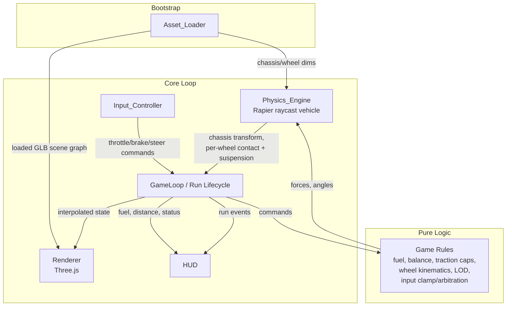

# Design Document: 3D Car Hill-Climb

## Overview

This design describes a browser-based 3D car hill-climbing game built in TypeScript. The player drives a high-resolution vehicle across continuously varying hilly terrain using throttle, brake, and steering controls. The vehicle is simulated as a **raycast vehicle** (a single dynamic chassis rigid body with four ray-based wheels) so that suspension, traction, and wheel behavior are physically plausible while remaining performant. Wheel meshes spin and steer independently of the chassis, suspension compression is reflected visually, and the game manages a fuel resource, balance/overturn state, and a run lifecycle with outcome reporting.

### Technology Stack (Constraints)

These are fixed project constraints carried from the requirements' Assumptions and Constraints section. They are not behavioral requirements but shape the architecture:

- **Language**: TypeScript
- **Rendering**: Three.js (WebGL2). React Three Fiber + Drei are an optional convenience layer; the core design is framework-agnostic and expressed in plain Three.js terms.
- **Physics**: Rapier compiled to WebAssembly (`@dimforge/rapier3d-compat`), using its `DynamicRayCastVehicleController` raycast-vehicle controller.
- **Build tooling**: Vite (with the WASM and top-level-await handling Rapier needs).
- **Assets**: Blender-authored glTF/GLB with Draco compression, loaded via Three.js `GLTFLoader` + `DRACOLoader`.
- **Targets**: Modern desktop browsers with WebGL2 + WebAssembly. Mobile touch is a secondary target.

### Key Design Decisions

1. **Raycast vehicle over full rigid-body wheels.** Rapier's raycast vehicle casts a ray from each wheel mount point down the suspension axis to find terrain contact, then applies suspension, friction (traction), and drive forces analytically. This is the standard approach for arcade/hill-climb driving: stable, cheap, and it maps directly onto the suspension (Req 3), traction (Req 6), and wheel-spin (Req 2) requirements. Full rigid-body wheels with joints are heavier and prone to instability over steep terrain.
2. **Decoupled simulation and rendering.** Physics advances on a **fixed 16.67 ms timestep** (Req 10.2) independent of frame rate; rendering interpolates between the two most recent physics states. This gives deterministic physics and smooth visuals across variable display refresh.
3. **Pure logic core, thin I/O shell.** Game rules that are amenable to testing (input clamping/arbitration, fuel depletion, suspension-compression math, wheel angular velocity, steering clamp, traction cap, balance classification, distance tracking, LOD state machine) are implemented as **pure functions** decoupled from Three.js/Rapier. This makes them unit- and property-testable without a browser or GPU.
4. **Wheel meshes are scene-graph siblings of the chassis, not children.** Each wheel mesh is positioned every frame from physics-derived data rather than being parented to the chassis. This satisfies the independence requirement (Req 2.5) directly.

### Requirements Coverage Map

| Requirement | Primary subsystem(s) | Where addressed |
|---|---|---|
| 1. High-res vehicle model | Asset_Loader | Asset Loading, Data Models, Asset Authoring |
| 2. Wheel rotation/steering viz | Renderer, Vehicle sync | Wheel Synchronization |
| 3. Suspension physics/viz | Physics_Engine, Renderer | Raycast Vehicle, Wheel Synchronization |
| 4. Terrain + gravity | Renderer, Physics_Engine | Terrain, Simulation Loop |
| 5. Throttle/brake/steering | Input_Controller | Input handling |
| 6. Traction | Physics_Engine | Raycast Vehicle, Traction |
| 7. Fuel | Game state | Run lifecycle, Fuel |
| 8. Balance/overturn | Physics_Engine, Game state | Balance detection |
| 9. Run lifecycle/outcome | Game state, HUD | Run lifecycle |
| 10. Rendering performance | Renderer, Simulation Loop | Simulation Loop, LOD |

## Architecture

### Subsystem Breakdown



The system has three layers:

- **Bootstrap layer**: `Asset_Loader` runs before gameplay. It loads and validates the vehicle and terrain GLBs, reports progress, and blocks entry into gameplay on failure.
- **Core loop layer**: A central `GameLoop` orchestrates `Input_Controller`, `Physics_Engine`, the pure rules, `Renderer`, and `HUD` each cycle. It owns the fixed-timestep accumulator and the run lifecycle state machine.
- **Pure logic layer**: Side-effect-free functions and small state reducers that encode the game's rules. These are the primary target for property-based testing.

### Subsystem Responsibilities

- **Asset_Loader** — Loads Draco-compressed GLBs, surfaces percentage progress, validates that the vehicle has exactly one chassis node and four named wheel nodes, enforces a 30 s timeout, and gates gameplay entry. (Req 1)
- **Renderer** — Owns the Three.js `Scene`, `WebGLRenderer`, camera, and lights. Draws each frame, applies wheel spin/steer/suspension transforms from synced state, and applies LOD level changes. (Req 2, 3.5, 4.1, 10)
- **Physics_Engine** — Wraps Rapier: the world, the chassis rigid body, the `DynamicRayCastVehicleController`, terrain collider, gravity, and the fixed-step `world.step()`. Exposes per-wheel contact, suspension, and traction state. (Req 3, 4.3–4.5, 6, 8.1)
- **Input_Controller** — Maps keyboard/touch to normalized throttle/brake/steer commands, clamps and arbitrates them, and samples once per frame. (Req 5)
- **GameLoop / Run lifecycle** — Fixed-timestep accumulator, run start/end detection, fuel accounting, balance evaluation, distance tracking, reset handling, outcome reporting. (Req 7, 8.2–8.4, 9, 10.2)
- **HUD** — Renders fuel (integer 0–100), distance, and run status / end-of-run summary. (Req 7.5, 9.3)

## Components and Interfaces

The interfaces below are written as TypeScript signatures. The pure-logic functions take plain data and return plain data; the I/O wrappers (Three.js, Rapier, DOM) sit behind thin classes.

### Asset_Loader

```typescript
interface VehicleMeshes {
  chassis: THREE.Object3D;          // exactly one
  wheels: [THREE.Object3D, THREE.Object3D, THREE.Object3D, THREE.Object3D]; // FL, FR, RL, RR
}

interface LoadProgress {
  asset: string;
  percent: number; // 0..100
}

type LoadResult<T> =
  | { ok: true; value: T }
  | { ok: false; error: AssetError };

interface AssetError {
  asset: string;                    // identifies failed/missing asset by name
  kind: 'network' | 'timeout' | 'parse' | 'missing-mesh';
  missingNode?: string;             // e.g. "wheel_RL" when kind === 'missing-mesh'
  message: string;
}

interface AssetLoader {
  loadVehicle(url: string, onProgress: (p: LoadProgress) => void): Promise<LoadResult<VehicleMeshes>>;
  loadTerrain(url: string, onProgress: (p: LoadProgress) => void): Promise<LoadResult<THREE.Object3D>>;
}

// Pure validation, independent of the loader I/O:
const REQUIRED_WHEEL_NODES = ['wheel_FL', 'wheel_FR', 'wheel_RL', 'wheel_RR'] as const;
const CHASSIS_NODE = 'chassis';

function validateVehicleGraph(root: THREE.Object3D): LoadResult<VehicleMeshes>;
```

`validateVehicleGraph` looks up the chassis and the four wheel nodes by name. If any are absent it returns `{ ok: false, error: { kind: 'missing-mesh', missingNode } }` (Req 1.5). The loader enforces the 30 s timeout via `Promise.race` against a timer (Req 1.3) and reports progress from `GLTFLoader`'s `onProgress` (Req 1.4).

### Input_Controller

```typescript
interface RawInput {
  throttle: number;   // may be out of range; possibly NaN from bad sources
  brake: number;
  steer: number;      // degrees, may be out of range
}

interface DriveCommand {
  throttle: number;   // clamped 0..1
  brake: number;      // clamped 0..1
  steerDeg: number;   // clamped -35..+35
}

// Pure: clamps each channel and applies brake-over-throttle arbitration.
function resolveInput(raw: RawInput): DriveCommand;

interface InputController {
  sample(): RawInput;             // reads keyboard/touch state once per frame
  readonly neutral: DriveCommand; // throttle 0, brake 0, steer 0
}
```

`resolveInput` clamps each channel to its bound (Req 5.7), forces `steerDeg = 0` / `throttle = 0` / `brake = 0` when no input is present is handled by the neutral default plus clamping (Req 5.4), and when both throttle and brake are present it zeroes the throttle for that frame (Req 5.6). The input control steering bound is -35..+35 degrees (Req 5.3); the *visual* steering bound is the wider -45..+45 (Req 2.3/2.4), handled separately in the renderer sync.

### Physics_Engine (Rapier raycast vehicle)

```typescript
interface WheelConfig {
  index: 0 | 1 | 2 | 3;
  connectionPointLocal: Vec3;     // mount point on chassis (local space)
  suspensionRestLength: number;   // > 0  (Req 3.1)
  suspensionStiffness: number;    // > 0
  suspensionDamping: number;      // >= 0
  maxSuspensionTravel: number;    // travel limit (Req 3.3, 3.4)
  radius: number;                 // wheel radius, for spin math (Req 2.1)
  isSteered: boolean;             // front wheels true
  isDriven: boolean;              // drive layout (e.g. all four)
  frictionSlip: number;           // surface friction coefficient 0.05..1.50 (Req 6.5)
}

interface WheelState {
  index: 0 | 1 | 2 | 3;
  inContact: boolean;             // ray hit terrain this step (Req 4.4)
  suspensionLength: number;       // current ray length to contact
  suspensionCompression: number;  // restLength - contactDistance, clamped (Req 3.2, 3.4)
  contactNormal: Vec3;
  steerDeg: number;               // applied steering this step
  // derived for traction (Req 6):
  normalForce: number;
  tractionLimit: number;          // frictionSlip * normalForce
  appliedDriveForce: number;      // capped at tractionLimit (Req 6.2)
  slipRatio: number;              // (Req 6.3)
}

interface VehicleState {
  chassisPosition: Vec3;
  chassisQuaternion: Quat;
  linearSpeed: number;            // m/s along forward axis (signed)
  horizontalSpeed: number;        // m/s in ground plane
  pitchDeg: number;               // (Req 8.1)
  rollDeg: number;                // (Req 8.1)
  wheels: WheelState[];
}

interface PhysicsEngine {
  init(wheels: WheelConfig[], terrain: THREE.Object3D): Promise<void>;
  setGravity(y: number): void;                 // -9.81 (Req 4.3)
  applyCommand(cmd: DriveCommand, fuelEmpty: boolean): void; // maps to engine/brake force + steer
  step(dt: number): void;                      // fixed dt = 1/60 (Req 10.2)
  readState(): VehicleState;
  reset(toPosition: Vec3): void;
}
```

Rapier mapping:

- The chassis is one dynamic `RigidBody` with a convex/box `Collider`. Gravity is set on the world to `(0, -9.81, 0)` (Req 4.3).
- `DynamicRayCastVehicleController` is created from the chassis body. Each wheel is added with `addWheel(connectionPoint, downDir, axleDir, restLength, radius)` and configured with `setWheelSuspensionStiffness`, `setWheelSuspensionCompression`/`Relaxation` (damping), `setWheelMaxSuspensionTravel`, and `setWheelFrictionSlip` (Req 3.1, 6.5).
- Each `world.step()` is preceded by `vehicleController.updateVehicle(dt)`, which raycasts each wheel (Req 4.4), computes suspension force from compression (Req 3.2), and resolves friction/traction at contact (Req 6.1). The controller naturally caps lateral/longitudinal force at the friction limit (Req 6.2) and produces slip when demand exceeds it (Req 6.3).
- Drive force is applied with `setWheelEngineForce(index, force)` for driven wheels, scaled by throttle and forced to 0 when fuel is empty (Req 6.4, 7.4). Brake uses `setWheelBrake`. Steering uses `setWheelSteering(index, radians)` for steered wheels.
- Out-of-contact wheels: the controller reports no contact; the engine sets suspension to full extension (Req 3.3) and applies zero drive force (Req 6.4).
- Resting penetration: a static terrain collider plus the suspension keeps wheels above the surface; we additionally assert no wheel penetrates more than 0.01 m at rest (Req 4.5).

Pure helpers extracted from the engine for testing:

```typescript
// Req 3.2, 3.4
function computeSuspensionCompression(restLength: number, contactDistance: number,
                                      minTravel: number, maxTravel: number,
                                      inContact: boolean): number;

// Req 6.1, 6.2 — returns transmitted force, never exceeding limit
function capDriveForce(demandedForce: number, frictionCoeff: number, normalForce: number): number;

// Req 8.1 — extract pitch/roll in degrees from an orientation
function pitchRollFromQuaternion(q: Quat): { pitchDeg: number; rollDeg: number };
```

### Renderer and Wheel Synchronization

The renderer keeps wheel meshes as **siblings** of the chassis under a shared `vehicleGroup`. Every rendered frame it computes each wheel mesh's local transform from the interpolated physics state.

```typescript
// Pure kinematics, Req 2.1, 2.2, 2.6
function wheelSpinDelta(groundSpeed: number, wheelRadius: number, dt: number): number; // radians this frame

// Pure clamp for the *visual* steering range -45..+45, Req 2.3, 2.4
function clampVisualSteer(commandedDeg: number): number;

// Pure: vertical offset of wheel relative to chassis from compression, Req 3.5
function wheelVerticalOffset(restLength: number, compression: number): number;

interface WheelVisualState {
  spinAngleRad: number;   // accumulated rotation about axle
  steerAngleDeg: number;  // about vertical axis, clamped -45..+45
  verticalOffset: number; // local Y offset reflecting compression
}

interface Renderer {
  setLOD(level: LODLevel): void;     // Req 10.3-10.6
  renderFrame(interp: InterpolatedState): void;
  measureFps(now: number): number;   // sliding-window fps
}
```

Synchronization rules:

- **Spin** (Req 2.1, 2.2): each frame the wheel's axle rotation advances by `wheelSpinDelta = (groundSpeed / radius) * dt`. Sign follows the direction of travel, so reverse motion spins the opposite way (Req 2.2). When ground speed is 0 and no throttle is applied, the delta is exactly 0, holding the angle constant (Req 2.6).
- **Steer** (Req 2.3, 2.4): the steerable wheel meshes rotate about their vertical axis to the commanded angle clamped to -45..+45 (Req 2.4). The renderer reaches the commanded angle within 100 ms by applying it on the next frame (Req 2.3, comfortably under 100 ms at >=10 fps).
- **Suspension** (Req 3.5): each wheel mesh's local Y is offset by `wheelVerticalOffset` so the mesh sits at the current compression within 0.001 m.
- **Independence** (Req 2.5): because wheels are not children of the chassis mesh, spinning/steering a wheel never transforms the chassis.

### Game state / Run lifecycle

```typescript
type RunStatus = 'idle' | 'running' | 'ended';
type EndReason = 'out-of-fuel' | 'overturned' | 'player-reset';
type BalanceState = 'upright' | 'overturned';

interface RunState {
  status: RunStatus;
  fuel: number;                 // 0..100
  startPosition: Vec3 | null;
  distanceTraveled: number;     // metres, horizontal
  balance: BalanceState;
  overturnElapsed: number;      // seconds chassis has been past threshold
  endReason: EndReason | null;
}

// Pure reducers (all Req 7, 8, 9):
function startRunIfMoving(state: RunState, horizontalSpeed: number, pos: Vec3): RunState; // Req 9.1
function depleteFuel(fuel: number, throttle: number, dt: number): number;                 // Req 7.2, 7.3
function updateDistance(state: RunState, currentPos: Vec3): RunState;                      // Req 9.2
function evaluateBalance(state: RunState, pitchDeg: number, rollDeg: number, dt: number): RunState; // Req 8.2-8.4
function applyEndConditions(state: RunState): RunState;                                    // Req 9.5, 9.6
function resetRun(startPosition: Vec3): RunState;                                          // Req 9.4
function isThrottleSuppressed(fuel: number): boolean;                                      // Req 7.4
```

### HUD

```typescript
interface HudView {
  fuelInt: number;              // Math.floor/round of fuel, 0..100 (Req 7.5)
  distanceText: string;         // run-end: rounded to 0.1 m (Req 9.3)
  status: RunStatus;
  endReason: EndReason | null;
}

function toHudView(run: RunState): HudView;   // pure projection
```

### LOD / Performance controller

```typescript
type LODLevel = 0 | 1 | 2 | 3;  // 3 = highest detail, 0 = lowest

interface LODState {
  level: LODLevel;
  secondsBelow30: number;       // continuous seconds fps < 30
  secondsBelow60: number;       // seconds fps < 60 since last reduction
  secondsAbove60: number;       // continuous seconds fps >= 60
}

// Pure state machine, Req 10.3-10.6
function updateLOD(state: LODState, fps: number, dt: number): LODState;
```

## Data Models

### Vehicle configuration (authored once, loaded at init)

```typescript
interface VehicleConfig {
  chassisMass: number;          // kg
  chassisHalfExtents: Vec3;     // collider size
  maxEngineForce: number;       // N, throttle 1.0 (Req 5.1)
  maxBrakeForce: number;        // N, brake 1.0 (Req 5.2)
  wheels: WheelConfig[];        // length 4
  driveLayout: 'fwd' | 'rwd' | 'awd';
}
```

### Terrain model

Terrain is authored in Blender as a continuous, non-self-intersecting heightfield-style mesh and exported as Draco GLB. Surface gradients are kept between 0° and 45° during authoring (Req 4.1). For physics, the terrain is loaded as either:

- a **trimesh collider** built from the GLB geometry (accurate, matches the visual exactly), or
- a **heightfield collider** if the terrain is authored on a regular grid (cheaper).

Per-region surface friction coefficients (0.05–1.50, Req 6.5) are stored in a side table keyed by material/region and applied to the corresponding wheel `frictionSlip` based on the contact point's material.

```typescript
interface TerrainModel {
  visual: THREE.Object3D;
  colliderKind: 'trimesh' | 'heightfield';
  frictionByRegion: Map<string, number>; // 0.05..1.50
}
```

### Physics tuning constants

```typescript
const GRAVITY_Y = -9.81;                 // Req 4.3
const FIXED_DT = 1 / 60;                 // 16.67 ms, Req 10.2
const START_FUEL = 100;                  // Req 7.1
const FUEL_BURN_RATE = 5;                // units/sec at throttle 1.0, Req 7.2
const RUN_START_SPEED = 0.5;             // m/s, Req 9.1
const OVERTURN_ANGLE = 75;               // degrees, Req 8.2
const OVERTURN_HOLD = 1.5;               // seconds, Req 8.2
const CONTROL_STEER_LIMIT = 35;          // degrees, Req 5.3
const VISUAL_STEER_LIMIT = 45;           // degrees, Req 2.3/2.4
const REST_PENETRATION_MAX = 0.01;       // metres, Req 4.5
const SUSPENSION_VIS_TOLERANCE = 0.001;  // metres, Req 3.5
const LOAD_TIMEOUT_MS = 30_000;          // Req 1.3
```

### Interpolated render state

```typescript
interface InterpolatedState {
  alpha: number;                          // 0..1 blend between prev and curr physics state
  prev: VehicleState;
  curr: VehicleState;
  command: DriveCommand;
}
```

## Correctness Properties

*A property is a characteristic or behavior that should hold true across all valid executions of a system — essentially, a formal statement about what the system should do. Properties serve as the bridge between human-readable specifications and machine-verifiable correctness guarantees.*

This feature's pure logic core is well-suited to property-based testing: input resolution, fuel accounting, suspension and wheel kinematics, traction capping, balance classification, run lifecycle reducers, the fixed-timestep accumulator, and the LOD state machine. Asset loading failure paths, infrastructure wiring (Rapier raycasting, on-hardware frame rate), and one-off configuration checks are covered by example, edge-case, integration, and smoke tests instead (see Testing Strategy).

The properties below were derived from the prework analysis, with redundant criteria consolidated into single comprehensive properties.

### Property 1: Vehicle scene-graph validation

*For any* loaded scene graph, `validateVehicleGraph` succeeds **if and only if** the graph contains exactly one node named `chassis` and all four named wheel nodes (`wheel_FL`, `wheel_FR`, `wheel_RL`, `wheel_RR`); otherwise it fails and the returned error names a missing or invalid node.

**Validates: Requirements 1.2, 1.5**

### Property 2: Wheel spin tracks ground speed and direction

*For any* ground speed `s`, wheel radius `r > 0`, and frame duration `dt >= 0`, `wheelSpinDelta(s, r, dt)` equals `(s / r) * dt` within numerical tolerance, the sign of the delta equals the sign of `s` (so reverse motion rotates opposite to forward), and the delta is exactly `0` when `s == 0`.

**Validates: Requirements 2.1, 2.2, 2.6**

### Property 3: Visual steering angle is clamped to [-45, 45]

*For any* commanded steering angle, `clampVisualSteer` returns a value within [-45, 45] degrees, returns the input unchanged when it is already in range, and returns the nearest bound when the input is out of range.

**Validates: Requirements 2.3, 2.4**

### Property 4: Wheel transforms are independent of the chassis

*For any* sequence of wheel spin and steering transforms applied to the wheel meshes, the chassis mesh's orientation and position remain unchanged.

**Validates: Requirements 2.5**

### Property 5: Suspension compression is well-defined and bounded

*For any* suspension rest length, measured contact distance, and travel limits `[minTravel, maxTravel]`: when the wheel is in contact, `computeSuspensionCompression` returns `max(0, restLength - contactDistance)`; when the wheel is not in contact it returns the full-extension (max travel) value; and in all cases the result lies within `[minTravel, maxTravel]`.

**Validates: Requirements 3.2, 3.3, 3.4**

### Property 6: Rendered wheel offset reflects compression within tolerance

*For any* suspension compression value within the travel range, the wheel mesh's computed vertical offset relative to the chassis differs from the offset implied by that compression by no more than 0.001 metres.

**Validates: Requirements 3.5**

### Property 7: Generated terrain is continuous with bounded gradient

*For any* generated terrain heightfield, the elevation difference between adjacent samples is finite (no vertical discontinuities), and the local surface gradient between adjacent samples is at most 45 degrees.

**Validates: Requirements 4.1**

### Property 8: Input resolution is bounded, proportional, and arbitrated

*For any* raw input (including out-of-range and non-finite channel values), `resolveInput` produces a command whose throttle and brake are within [0, 1] and steering is within [-35, 35]; in-range values pass through unchanged and out-of-range values clamp to the nearest bound; throttle and brake map proportionally to force (0 -> zero force, 1 -> configured maximum); when no input is active the command is (0, 0, 0); and when both throttle and brake are active the throttle force is suppressed to 0 while the brake is applied.

**Validates: Requirements 5.1, 5.2, 5.3, 5.4, 5.6, 5.7**

### Property 9: Drive force never exceeds the traction limit

*For any* surface friction coefficient, normal force, contact state, and demanded drive force: the traction limit equals `frictionCoefficient * normalForce`; the transmitted drive force equals `min(demandedForce, tractionLimit)` when the wheel is in contact and `0` when it is not; and whenever the demanded force exceeds the traction limit the modeled wheel slip ratio exceeds 0.05.

**Validates: Requirements 6.1, 6.2, 6.3, 6.4**

### Property 10: Surface friction coefficient stays within bounds

*For any* terrain contact region, the resolved surface friction coefficient is within [0.05, 1.50] inclusive.

**Validates: Requirements 6.5**

### Property 11: Fuel depletes proportionally and never goes negative

*For any* current fuel level, throttle input in [0, 1], and elapsed simulation time `dt >= 0`, `depleteFuel` reduces fuel by `5 * throttle * dt` before clamping, and the resulting fuel value is always greater than or equal to 0.

**Validates: Requirements 7.2, 7.3**

### Property 12: Empty fuel suppresses throttle force

*For any* throttle input, when the fuel level is 0 the resulting engine drive force is 0.

**Validates: Requirements 7.4**

### Property 13: HUD projection bounds fuel and rounds distance

*For any* run state, the HUD fuel value is an integer within [0, 100] equal to the rounded fuel level, and the HUD distance value equals the run's distance rounded to the nearest 0.1 metres with an end reason that is one of `out-of-fuel`, `overturned`, or `player-reset`.

**Validates: Requirements 7.5, 9.3**

### Property 14: Pitch and roll extraction round-trips

*For any* pitch and roll angles within the valid range, constructing a chassis orientation quaternion from those angles and then extracting pitch and roll via `pitchRollFromQuaternion` recovers the original angles within numerical tolerance, and the extracted values are always finite.

**Validates: Requirements 8.1**

### Property 15: Balance becomes overturned only after sustained threshold breach

*For any* sequence of per-frame pitch/roll angles and frame durations, `evaluateBalance` sets the balance state to overturned exactly when either angle exceeds 75 degrees continuously for at least 1.5 seconds, and keeps (or resets to) the upright state with a zeroed overturn timer whenever both angles are at or below 75 degrees.

**Validates: Requirements 8.2, 8.3**

### Property 16: Run end conditions are honored

*For any* active run state, `applyEndConditions` ends the run when fuel reaches 0 (reason `out-of-fuel`) or when the balance state is overturned (reason `overturned`), and the ended state carries exactly one end reason.

**Validates: Requirements 8.4, 9.5, 9.6**

### Property 17: A run starts when horizontal speed first exceeds the threshold

*For any* idle run state and horizontal speed, `startRunIfMoving` transitions the run to active and records the current position as the start position if and only if the horizontal speed exceeds 0.5 m/s; once started, the recorded start position does not change.

**Validates: Requirements 9.1**

### Property 18: Distance is the horizontal displacement from the start

*For any* recorded start position and current position, `updateDistance` sets the tracked distance to the Euclidean distance between the two positions measured in the horizontal (ground) plane only, ignoring vertical displacement, and the result is non-negative.

**Validates: Requirements 9.2**

### Property 19: Reset restores the defined initial run state

*For any* prior run state, `resetRun` produces a state with fuel restored to 100, tracked distance 0, balance upright, the vehicle positioned at the start position, and no active run in progress.

**Validates: Requirements 9.4**

### Property 20: Fixed-timestep accumulation is frame-rate independent

*For any* sequence of variable per-frame durations, the fixed-timestep accumulator advances the physics by a whole number of steps equal to `floor(accumulated / FIXED_DT)`, every step uses exactly `FIXED_DT` (1/60 s), and the leftover remainder is carried to the next frame — so total simulated time depends only on elapsed real time, not on frame pacing.

**Validates: Requirements 10.2**

### Property 21: LOD level adjusts within bounds based on sustained frame rate

*For any* sequence of measured frame rates and frame durations, `updateLOD` keeps the detail level within `[0, 3]`; reduces the level by exactly one step per re-evaluation window while the rate stays below threshold (and never below the lowest level); and raises the level by one step after the rate sustains at least 60 fps for more than 5 seconds (and never above the highest level).

**Validates: Requirements 10.3, 10.4, 10.5, 10.6**

## Error Handling

### Asset loading errors (Req 1.3, 1.5, 4.2)

- **Network/parse failure**: `GLTFLoader` rejection is caught and converted to an `AssetError` with `kind: 'network' | 'parse'` and the asset name. Gameplay entry is blocked; the previously loaded state is retained.
- **Timeout**: each load is wrapped in `Promise.race([load, timeout(30_000)])`. On timeout the loader returns `{ ok: false, error: { kind: 'timeout', asset } }`, surfaces a message identifying the asset, and does not enter gameplay (Req 1.3).
- **Missing meshes**: after a successful parse, `validateVehicleGraph` runs. A missing chassis or any of the four wheels yields `{ kind: 'missing-mesh', missingNode }`; the load is treated as failed and gameplay is halted (Req 1.5).
- **Terrain load failure**: handled identically — run start is halted, an error indication is shown, and prior game state is retained (Req 4.2).
- **User-facing surface**: the loading overlay switches from a progress bar to an error panel naming the failed/missing asset, with a retry affordance.

### Physics and runtime errors

- **Rapier init failure (WASM)**: if the WASM module fails to instantiate, the game shows a fatal "physics engine unavailable" message and does not start. This is detected at bootstrap before any run.
- **Non-finite inputs**: `resolveInput` and the pure math helpers treat `NaN`/`Infinity` defensively — non-finite channels are coerced to their safe default (0) before clamping, so a bad input source can never inject non-finite forces into the simulation.
- **Degenerate wheel radius**: spin math guards against `radius <= 0` (treated as a configuration error caught by the config smoke test, Req 3.1) so division by zero cannot occur at runtime.

### State-machine guards

- Run lifecycle reducers are total functions: every `(state, event)` pair maps to a defined next state. Ending an already-ended run is idempotent; resetting is always valid from any state.
- Balance evaluation clamps its accumulator so transient threshold breaches below 1.5 s never latch the overturned state (Req 8.2).

## Testing Strategy

### Dual approach

The codebase separates a **pure logic core** (testable without a browser, GPU, or WASM) from **thin I/O wrappers** around Three.js, Rapier, and the DOM. Property-based tests cover the pure core; example, edge-case, integration, and smoke tests cover everything else.

### Property-based tests

- **Library**: `fast-check` (the standard PBT library for the TypeScript/JS ecosystem), run under Vitest. We do not implement property testing from scratch.
- **Iterations**: each property test runs a minimum of 100 generated cases (`fc.assert(..., { numRuns: 100 })` or higher).
- **Traceability**: each property test is tagged with a comment in the format
  `// Feature: 3d-car-hill-climb, Property {number}: {property text}`
  and references the design property and the requirement(s) it validates.
- **Coverage**: Properties 1–21 above are each implemented by a single property-based test. Generators are built for raw inputs (including out-of-range and non-finite values), suspension parameters, friction/normal-force pairs, fuel/throttle/dt triples, orientation quaternions, angle sequences, position pairs, variable frame-duration sequences, and fps sequences.

### Unit / example tests

- Throttle/brake force endpoints and a fuel-init example (Req 7.1).
- Input sampling cadence: one sample per frame tick (Req 5.5).
- Loading progress indicator: clamped 0–100 and removed only after validated meshes are present (Req 1.4).

### Edge-case tests

- Asset load rejection, parse failure, and 30 s timeout, each asserting the error names the asset and gameplay is not entered (Req 1.3).
- Terrain load failure halting run start while retaining prior state (Req 4.2).

### Integration tests (Rapier + terrain, limited examples)

- Per-frame collision evaluation produces contact state for all four wheels while driving on terrain (Req 4.4).
- At-rest settling on several slopes keeps wheel penetration <= 0.01 m (Req 4.5).
- An end-to-end driving session validates that suspension, traction, and slip emerge coherently from the configured raycast vehicle.

### Smoke / configuration tests

- The shipped vehicle GLB loads with the chassis >= 20,000 triangles, each wheel >= 5,000 triangles, and all five named nodes present (Req 1.1).
- The vehicle suspension config satisfies restLength > 0, stiffness > 0, damping >= 0, all finite, for all four wheels (Req 3.1).
- World gravity is set to (0, -9.81, 0) (Req 4.3).

### Performance verification (on target hardware)

- Frame-rate measurement over a play session confirms >= 60 fps average over 1 s sliding windows on target desktop hardware (Req 10.1). This is a manual/automated on-hardware measurement, not a unit test, since it depends on the runtime environment. The fixed-timestep accumulator (Property 20) and LOD state machine (Property 21) are verified separately as pure logic.

## Asset Authoring Note (high-resolution car with separable wheels)

The high-resolution vehicle GLB (Req 1.1, 1.2) must ship with the chassis and four wheels as **independently named, separable nodes** so the renderer can transform each wheel without affecting the chassis (Req 2.5). Sourcing/authoring options, in order of preference:

1. **Author in Blender from a CC0/licensed base mesh.** Model or import a detailed car body, subdivide/sculpt the chassis to exceed 20,000 triangles, and model each wheel (tire + rim) to exceed 5,000 triangles. Place each wheel as a separate object with a clean origin at the wheel's rotation center and the axle aligned to the local X axis, then name the objects `chassis`, `wheel_FL`, `wheel_FR`, `wheel_RL`, `wheel_RR`.
2. **Acquire a licensed high-poly car model** (e.g. from a marketplace or a CC-licensed source) and re-topologize/split it in Blender so wheels are separate objects with correct origins and names. Verify polygon budgets meet the minimums.

In all cases, before export: apply transforms, set each wheel origin to its hub center, ensure the axle axis is consistent across wheels, and verify the node names exactly match `CHASSIS_NODE` and `REQUIRED_WHEEL_NODES`. Export as GLB with **Draco mesh compression** enabled. The `validateVehicleGraph` check (Property 1) enforces the node contract at load time, and the smoke test (Req 1.1) enforces the polygon budget on the shipped asset.
